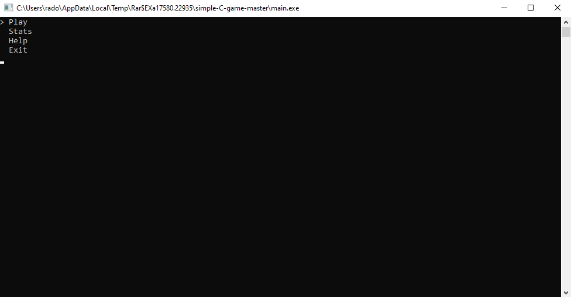
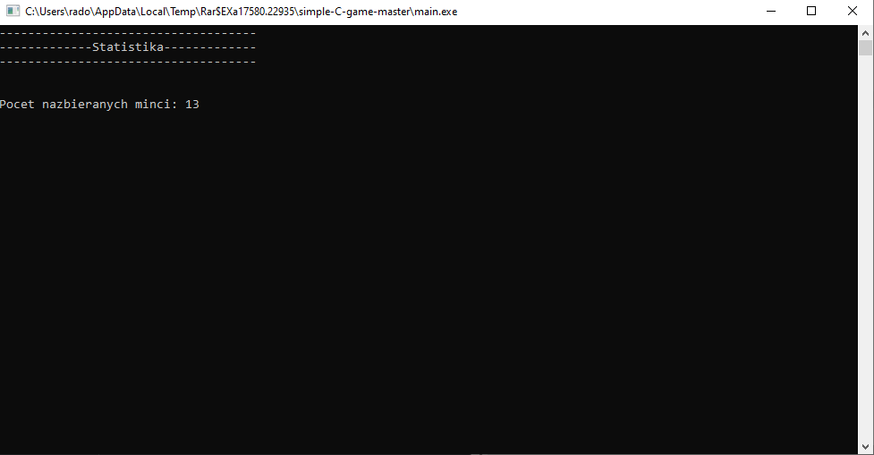
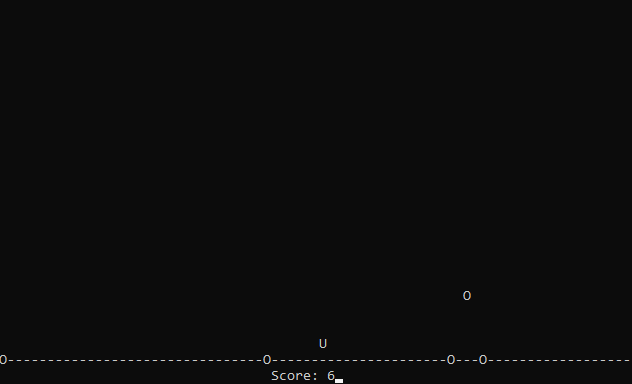

# simple-C-game
Simple console ASCII game written in C.
You have to collect as many coins as possible.
Movement is by A and D keys. Game also save your stats.
At the start there is a simple game menu.

### Main menu

### Stats

### Game

